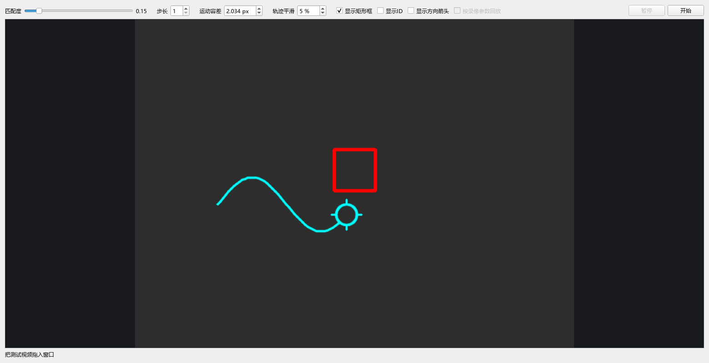

# 视觉追踪独立源码接入包

算法 **V2.5.1**，检测模型 **V4**。本包提供视频测试GUI、追踪核心、窗口定位、模板及独立接入API；不包含原主程序、战斗、导航、账号登录、远程Host、训练工具或私人配置。

## 1. 先运行视频测试GUI

推荐Windows 10/11、64位Python 3.11或3.12。源码保持Python 3.11+语法，实际验收环境见 `VERIFIED_ENVIRONMENT.json`。在解压根目录打开PowerShell：

```powershell
py -3.11 -m venv .venv
.\.venv\Scripts\python.exe -m pip install --upgrade pip
# CPU环境可用以下命令。需要NVIDIA GPU时，先安装与驱动匹配的torch/torchvision。
.\.venv\Scripts\python.exe -m pip install torch torchvision
.\.venv\Scripts\python.exe -m pip install -r requirements.txt
.\.venv\Scripts\python.exe -m liescd.gui
```

安装CUDA版PyTorch时，使用其官方安装页为自身系统生成的命令：
https://pytorch.org/get-started/locally/ 。不要照搬分享者电脑的CUDA版本。
检查GPU：

```powershell
.\.venv\Scripts\python.exe -c "import torch; print(torch.__version__); print(torch.cuda.is_available())"
```

完成安装后也可双击 `run_gui.bat`。首次安装需要下载公开依赖；本包本身不需要账号、API密钥、Docker或远程推理服务。GUI加载的是包内模型，不会主动下载替代权重。

要在自己的程序目录直接导入，可在包根目录使用 `.\.venv\Scripts\python.exe -m pip install .`，把SDK安装到目标解释器环境。模型、CN/TW模板和OC-SORT许可证都配置为包内资源。SDK包版本0.1.0仅表示这层独立接入封装，不是追踪算法版本，也不是对方程序版本。星形提示图片位于ZIP的alert目录，若自行使用，需另外配置资源路径。

操作步骤：

1. 拖入视频到测试窗口，也可以在启动命令后附上视频路径。
2. 视频最好已经裁成视觉任务的**内容区**。GUI把整幅视频当作追踪输入，并不自动裁剪全屏录像。
3. 匹配度默认0.15、运动容差内部值2.034259190993516、平滑强度5；初次对比保持默认、步长1。
4. 点击开始；可以暂停/继续。轨迹线会随目标追踪绘制，勾选显示矩形框、显示ID可观察检测与身份。“显示方向箭头”默认关闭，勾选后显示各图形和中央整体方向，播放中可切换。
5. 普通视频不要勾选“按录像参数回放”。该选项需要本项目格式的旁车文件，且会覆盖界面参数。
6. 换视频重新开始；不要从已结束视频的身份状态继续。
7. 模型准备阶段可能持续数秒，GPU会预热多个尺寸，不等于卡死。CPU也可运行，但不保证实时速度。

当前GUI标题说明版本；保留原有视觉追踪绘制代码，没有搬入主窗口。GUI不移动系统鼠标。



## 2. 包内目录

| 目录/文件 | 用途 |
|---|---|
| `liescd/` | 原有检测、追踪、平滑、视频读写、GUI和必要依赖 |
| `liescd/models/geometry.pt` | V4模型，已移除训练与Git元数据，张量不变 |
| `liescd/_vendor/ocsort/` | OC-SORT源码、来源说明和MIT许可；FilterPy派生代码保留原声明 |
| `liescc/` | 窗口定位和CN/TW成功界面模板 |
| `alert/` | 三张星形提示模板，供调用方按需接入；示例不会自行常驻监听星形提示 |
| `vision_sdk/` | 独立会话、坐标映射、成功检测和鼠标回调适配器 |
| `examples/` | 视频、实时截图接入示例 |
| `tests/` | 接口边界测试，不带训练素材 |
| `docs/INTEGRATION.md` | 完整API、坐标、生命周期和接入说明 |
| `docs/PRIVACY_AND_SCOPE.md` | 分享边界、脱敏和功能差异 |
| `SOURCE_PROVENANCE.json` | 算法/模型标识与来源文件校验，不含私人仓库信息 |
| `VALIDATION.json` | 本次实际验证结果 |
| `MANIFEST.json` | 分享文件的大小与SHA256；不包含自身 |
| `SANITIZATION_REPORT.json` | 敏感信息与依赖边界检查结果 |

## 3. 最小集成

```python
import time
from vision_sdk import Session, MouseOutput

# capture_bgr、left_button_held、move_mouse由你自己的程序实现。
output = MouseOutput(move_mouse)
with Session() as session:
    session.prepare()                 # 在任务出现前预热
    session.reset()                   # 新任务，从开场开始
    output.reset()
    while task_is_running():
        stamp = time.monotonic()      # 必须是截图源时间，不是推理完成时间
        frame, origin = capture_bgr() # BGR uint8；origin是截图左上角屏幕物理坐标
        output.manual(left_button_held())
        result = session.process(frame, stamp, screen_origin=origin)
        output.manual(left_button_held())
        output.emit(result)          # 无点/过期/手动接管/结束时不会调用move_mouse
        if result.phase in ('SUCCESS', 'ENDED'):
            break
```

这段展示接线关系，五个外部函数由调用方提供；可直接运行的完整示例在 `examples/`。
`Session`使用同一生产追踪核心；新封装的同步生命周期不是原主程序异步调度的完整复制。完整差异、成功确认和人工接管责任见接入文档。

## 4. 可直接运行的示例

```powershell
# 内容区视频；仅显示框与轨迹
.\.venv\Scripts\python.exe -m examples.video "your_video.mp4"
# 包含完整任务窗口的录像，自动定位ROI
.\.venv\Scripts\python.exe -m examples.video "full_window.mp4" --full-frame
# 截取桌面矩形，只预览，不移动鼠标
.\.venv\Scripts\python.exe -m examples.live --rect 100 100 1200 800
# 矩形已经是内容区；不进行成功面板检测，ESC手动结束
.\.venv\Scripts\python.exe -m examples.live --rect 100 100 800 600 --content
# 明确启用Windows鼠标移动。不要把预览窗口覆盖到截图区域
.\.venv\Scripts\python.exe -m examples.live --rect 100 100 1200 800 --move
```

`--rect`依次是屏幕左、上、宽、高，单位为物理像素。实时例子按最多约20Hz串行处理，不积压历史帧。左键按住暂停输出，ESC退出；松开后有150ms宽限。示例不点击成功按钮，也不执行休息或换频道。VM或远程窗口必须用调用方实际有效的鼠标后端替换回调，不能假定SetCursorPos一定被目标程序接受。

## 5. 验证、排错与分发

```powershell
.\.venv\Scripts\python.exe -m unittest discover -s tests -v
```

- `No module named liescd/vision_sdk`：在包根目录运行，或把包根目录加入你的程序导入路径；三个包目录一起保留。
- 有视频没锁定：检查是否从高亮开场开始、是否只输入内容区、模板版本及模型是否匹配。
- `LOCATING`不结束：画面需要包含完整双锚点；确认缩放、遮挡。已知ROI时显式传入，不要把全屏当内容区。
- 框有但鼠标没动：视频GUI从不移动鼠标；实时示例默认预览。另检查状态、0.2秒新鲜度、手动接管与坐标原点。
- 大量过期：先预热、检查GPU与输入速度；不要通过回放积压坐标补追。
- 黑屏：检查截图方法和窗口遮挡；替换调用方截图适配器，模型不能修复黑屏。
- 时间戳报错：每次传新的实际源帧和递增时间，视频用PTS，实时用monotonic；不要把视频秒数交给实时MouseOutput。
- `SUCCESS_PENDING`后不再移动：MouseOutput为保守防误操作而锁住输出，交由调用方判断本轮结束；只有明确新任务才reset。

分发时请把整个ZIP交给对方。不要只拿 `branch_tracker.py` 或 `geometry.pt`。第三方声明见 `THIRD_PARTY_NOTICES.md`；本包不附带原私人仓库历史或对整个项目的开源授权声明。
